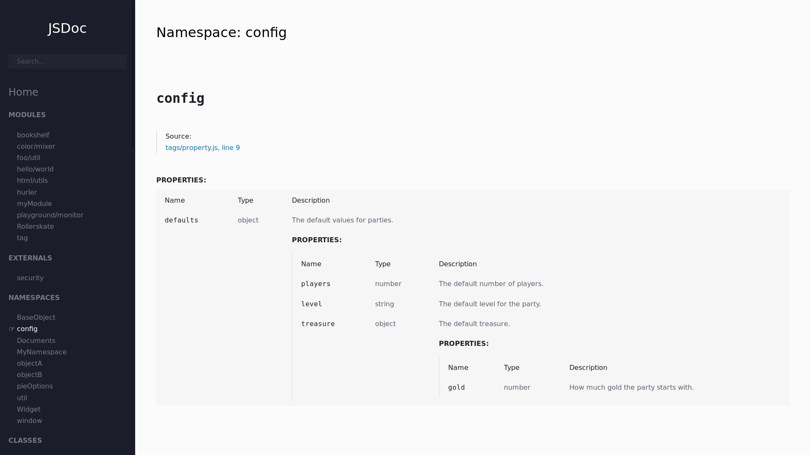
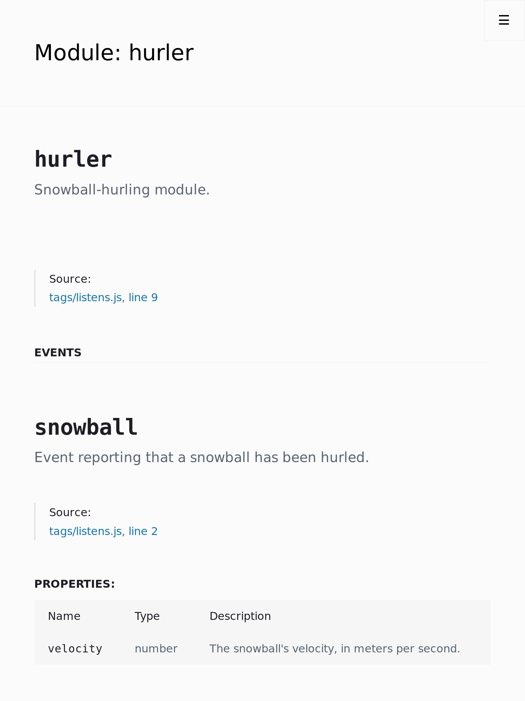
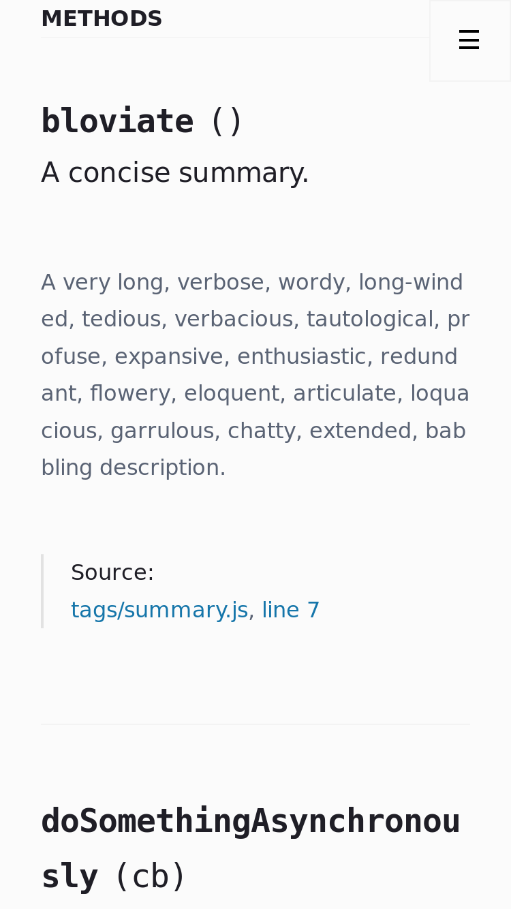
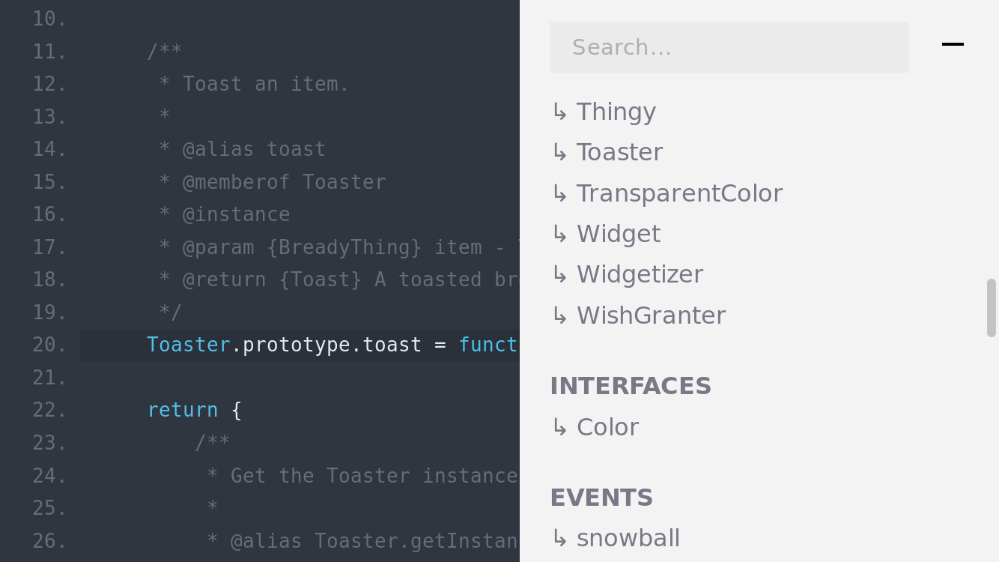

# JSDoc Template

A decent template for JSDoc, redesigned from [the default template](https://github.com/jsdoc/jsdoc/templates/default).

- 
- 
- 
- 

## Try it

Clone this repo, run ``` npm start ``` and wait until your default browser starts.

When you finish, just press ``` CTRL + c ``` or close the console.

## Use it

Use ``` jsdoc path/to/your/files -t path/to/this/template ``` from a CLI.

## Customize it

Make this template yours too:
- Create a ``` jsdoc.config.js ``` file.
- Modify it ([see all supported properties](config.js)).
- Load it from jsdoc: ``` jsdoc path/to/files -t path/to/this/template -c path/to/jsdoc.config.js ```.

### Examples

#### Changing the default font (the simplest way)
```js
// jsdoc.config.js

module.exports = {
	templates: {
		// Options for this template.
		custom: {
			tags: {
				head: [
					`<style>body, html { font-family: serif; }</style>`
				]
			}
		}
	}
}

```

#### Changing the theme for the prettified code and replacing it with my own (this time by using a JSON)

```json
// jsdoc.config.json

{
	"templates": {
		"default": {
			"staticFiles": {
				"include": [
					"./path/to/your/theme.css"
				]
			}
		},
		"custom": {
			"themes": {
				"prettify": "theme.css"
			}
		}
	}
}

```

#### Changing the site name and adding a favicon

```javascript
// jsdoc.config.js

module.exports = {
	templates: {
		default: {
			staticFiles: {
				include: [
					'path/to/your/favicon-32x32.png'
				]
			}
		},
		custom: {
			siteName: 'My site',
			tags: {
				head: [
					`<link href="favicon-32x32.png" rel="icon" sizes="32x32" type="image/png"/>`
				]
			}
		}
	} 
};

```

## Contribute

Your contributions are welcome (and needed). Please check the [CONTRIBUTING](CONTRIBUTING.md) file for details.

## Versioning

This project uses [SemVer](http://semver.org/) for versioning. See the available versions [here](https://github.com/AlexisPuga/jsdoc-template/tags).

## License

Any modification made to the [default template](https://github.com/jsdoc/jsdoc/templates/default) is licensed under the Apache License, Version 2.0 - See the [LICENSE](LICENSE) file for details.

For more information, check [the main project](https://github.com/jsdoc/jsdoc).

## Acknowledgments

Thanks to [all people who contributed to this project](https://github.com/AlexisPuga/jsdoc-template/graphs/contributors), and [people who participated in the original one](https://github.com/jsdoc/jsdoc/graphs/contributors).
