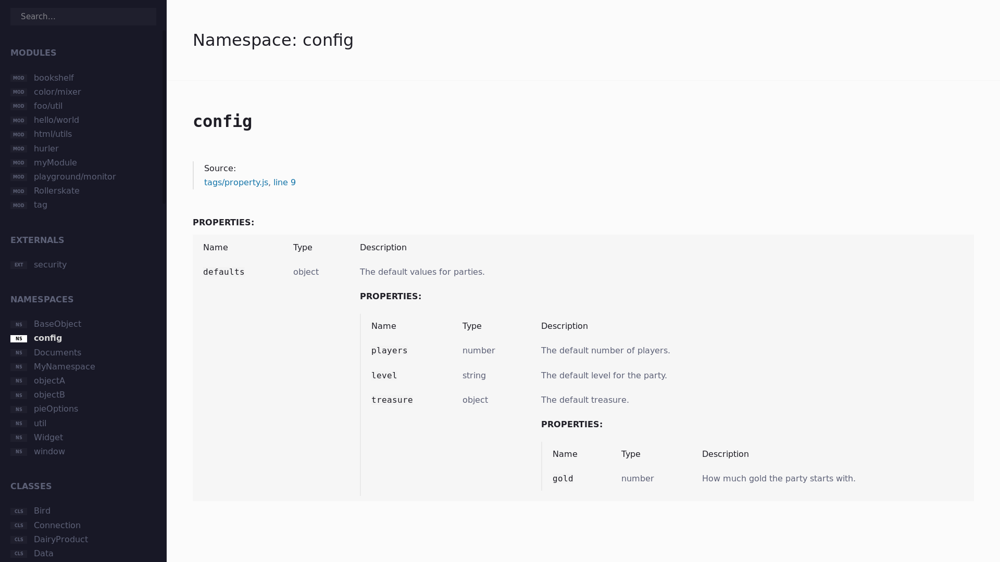
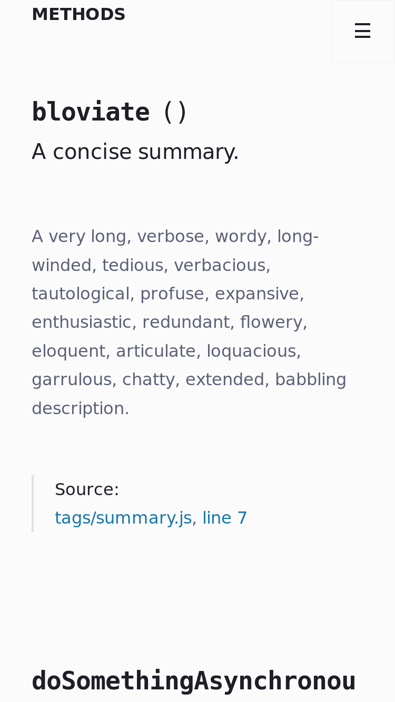

# JSDoc Template 

A decent template for JSDoc, redesigned from [the default template](https://github.com/jsdoc/jsdoc/tree/master/packages/jsdoc/templates/default).

[Check out the demo](https://alexispuga.github.io/jsdoc-template).

## Use it

### Installing it via npm
[](https://npmjs.org/package/@alexispuga/jsdoc-template)

```bash
npm i @alexispuga/jsdoc-template
jsdoc your/files -t ./node_modules/@alexispuga/jsdoc-template
```

## Previews

<a href="previews/pc.png"></a>
<a href="previews/tablet.png"></a>
<a href="previews/phone.png"></a>

## Customize it

Make this template yours too:
- Create a ``` jsdoc.config.js ``` file.
- Modify it ([see all supported properties](config.js)).
- Load it from jsdoc: ``` jsdoc your/files -t this/template -c your/jsdoc.config.js ```.

### Examples

#### Changing the default font (the simplest way)
```js
// jsdoc.config.js

module.exports = {
    templates: {
        // Options for this template.
        custom: {
            tags: {
                head: [
                    `<style>body, html { font-family: serif; }</style>`
                ]
            }
        }
    }
}

```

#### Changing the theme for the prettified code and replacing it with my own (this time by using a JSON)

```json

{
    "templates": {
        "default": {
            "staticFiles": {
                "include": [
                    "./path/to/your/theme.css"
                ]
            }
        },
        "custom": {
            "themes": {
                "prettify": "theme.css"
            }
        }
    }
}

```

#### Changing the site name and adding a favicon

```javascript
// jsdoc.config.js

module.exports = {
    templates: {
        default: {
            staticFiles: {
                include: [
                    'path/to/your/favicon-32x32.png'
                ]
            }
        },
        custom: {
            siteName: 'My site',
            tags: {
                head: [
                    `<link href="favicon-32x32.png" rel="icon" sizes="32x32" type="image/png"/>`
                ]
            }
        }
    } 
};

```

## Contribute

Your contributions are welcome (and needed). Please check the [CONTRIBUTING](CONTRIBUTING.md) file for details.

## Versioning

This project uses [SemVer](http://semver.org/) for versioning. See the available versions [here](https://github.com/AlexisPuga/jsdoc-template/tags).

## License

Any modification made to the [default template](https://github.com/jsdoc/jsdoc/templates/default) is licensed under the Apache License, Version 2.0 - See the [LICENSE](LICENSE) file for details.

For more information, check [the main project](https://github.com/jsdoc/jsdoc).

## Acknowledgments

Thanks to [all people who contributed to this project](https://github.com/AlexisPuga/jsdoc-template/graphs/contributors), and [people who participated in the original one](https://github.com/jsdoc/jsdoc/graphs/contributors).
